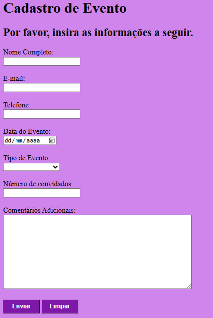
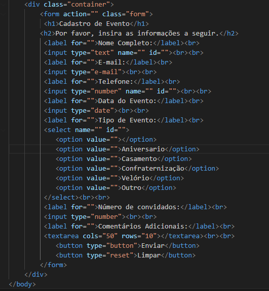
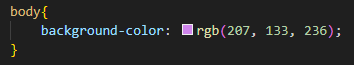
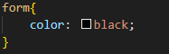
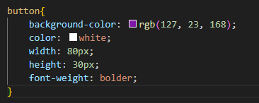

# Projeto - Form-CadEvent
 
O projeto foi criado como parte avaliativa da disciplina de Fundamentos de Desenvolvimento Web, ministrada pelo professor Leonardo Rocha.
 
## Índice
 
* [Descrição](#descrição)
* [Resultado](#resultado)
* [Tecnologias](#tecnologias)
* [Referências](#referência)
* [Autor(a)](#autora)
 
## Descrição
 
O projeto se consiste, basicamente, na criação de um Formulário de Cadastro de Evento, onde o cliente deve inserir os dados do evento que quer realizar, sendo viável a exclusão dos dados inseridos caso o indivíduo desejar mudar.
 
## Resultado
 

 
### Estrutura
 
 * Form - O elemento form representa uma coleção de elementos associados ao formulário.
 * H1 - O elemento h1 representa um título de seção.
 * H2- O elemento h2 representa um título de seção.
 * Label - O label representa uma legenda para um item em uma interface de usuário.
 * Input - O elemento input representa um campo com um controle de formulário para permitir ao usuário editar os dados.
 * Select - O elemento select representa um controle para selecionar entre um conjunto de opções.
 * Option - O elemento option representa uma opção em um elemento select.
 * Br - O br produz uma quebra de linha em um texto.
 * Textera - O elemento textarea representa um controle de edição de texto simples de múltiplas linhas para o valor bruto do elemento.
 * Button - O elemento button representa um botão rotulado por seu conteúdo.
 
 
 
 
### Estilização
 
O projeto foi estilizado usando o CSS3. No arquivo CSS referido a página do projeto constam configurações de estilo apresentadas a seguir:
 
_Body_ -
  * Background-color - O background-color é responsável por definir a cor de fundo.
 

 
_Form_ -
  * Color - Define a cor do texto de um elemento.
 

 
_Button_ -
  * Background-color - O background-color é responsável por definir a cor de fundo.
  * Color - Define a cor do texto de um elemento.
  * Width - Especifica a largura da área de conteúdo, área de preenchimento ou área de borda.
  * Heigth - O height é resposável por determinar a altura da área do conteudo do elemento.
  * Font-heigth - Especifica o peso dos glifos na fonte, seu grau de escuridão ou espessura do traço.
 

 
## Tecnologias
 
* __HTML5__
* __CSS3__
* __README__
* __Git__
* __Github__
 
### Referências
 
[Alura](https://www.alura.com.br/artigos/escrever-bom-readme) - Como escrever um README incrível no seu Github 
[lohhans](https://gist.github.com/lohhans/f8da0b147550df3f96914d3797e9fb89) - Um modelo para fazer um bom README 
[Dio](https://www.dio.me/articles/personalize-o-readme-no-github) - Personalize o README no Github 
[w3schools](https://www.w3schools.com) - informação sobre diversos elementos de html e css
 
### Autor(a)
 
O projeto foi desenvolvido pela estudante Isabelly dos Reis Santos, aluna do primeiro ano do Ensino Médio do Marista Social Irmão Acácio.